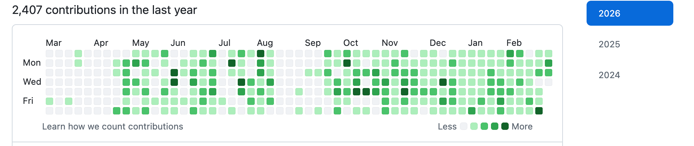

# 备战计划严格执行

## 八股

[文档链接](https://www.yuque.com/cuggz/interview/pgw8v4)

从HTML到浏览器原理（除react）

## 算法

刷简单和中等

刷题策略：计时器，30分钟以内做不出来看答案，vscode不要有任何提示，白板写题

周一 1-2

周二 3-4

周三 1-4

周四 5-6

周五 7-8

周六 1-8

周日休息

## 项目

晚上看react项目并建立仓库3个小时

创建一个新的项目和自己写一个react项目，创建仓库写文档

教一个ai项目

每天保持绿点，将算法、代码，push到github上，star fork 每天搞几个增加活跃度

## 时间安排

8点开始学习

8～11点 背八股，

11到12:30做饭吃饭

13:00到15:00做算法

15:00到晚上22:00做项目

todoList每日进行汇总更新

下周之前把bug给修复一下

## 面试过程

1. 展示项目能直接演示，能够部署最好
2. 项目挖掘，start法则，不要只是描述经验；注意听面试官问题的用意，问了几个问题，是否答全；不可托大，面对不知道的问题可以说不知道，但是要有思考过程
3. 思考时间话术：请您给我十几秒的思考时间
4. 写算法题要先说思路，再去写实际代码
5. 照片换个更利索的

### S

随着竞赛编程学习需求增长，我司需要一个集**语法入门、在线刷题、自动判题、周赛举办、历年 CSP/NOIP 真题题库**于一体的在线编程平台

### T

我在项目中主要负责前端页面核心开发：

1. 负责平台题库和题单模块的开发，包含题目列表，题目详情，难度的筛选等
2. 负责比赛模块，支持比赛列表、详情、倒计时、提交记录等
3. 优化页面加载速度，题库、题目列表，保证平台长期稳定可用

### A

1. 从架构层设计比赛模块的整体思路，不仅仅是题目列表的展示、还包含处理比赛的时间、题目的解锁以及实施的排名，比赛结束后的榜单冻结等复杂状态的处理
2. 大列表的性能优化，题库列表的分页和条件筛选、搜索输入的防抖截流，排行榜的分页和虚拟滚动、骨架屏和错误的兜底机制，从而降低首屏的压力，提升弱网环境的用户体验
3. 分享与邀请链路，基于比赛ID生成唯一的分享链接，通过短码映射到比赛的详情页，降低原始的URL暴露的复杂度
4. 做多端自适应布局，兼容不同屏幕尺寸，优化懒加载、图片资源、接口请求防抖，提升页面流畅度

### R

1. 完整落地整个 OJ 平台核心功能，页面加载速度、交互流畅度明显提升，多端适配无布局错乱，线上运行稳定无重大 BUG，平台上线后顺利推广至所有学员，测评参与度提升40%
